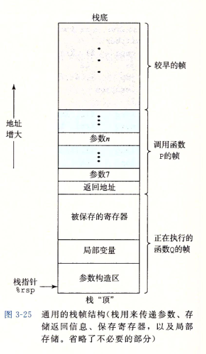
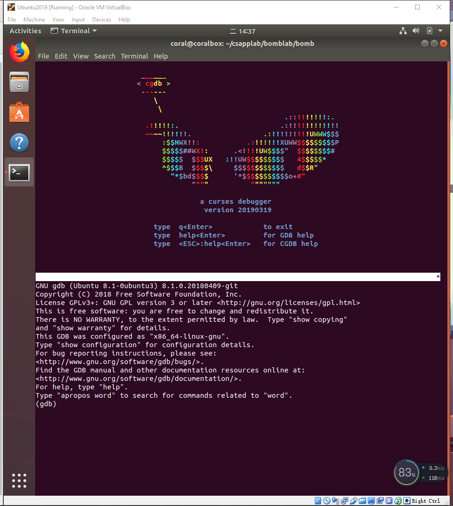
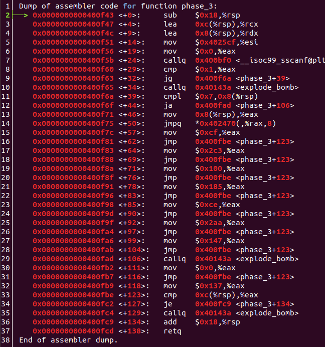
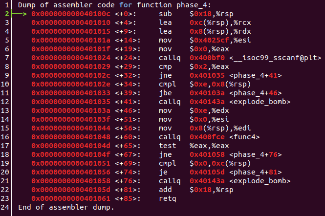
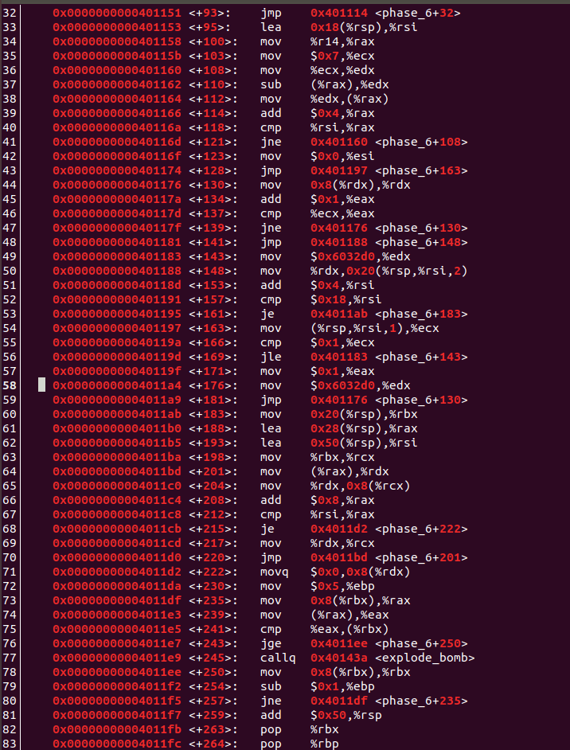
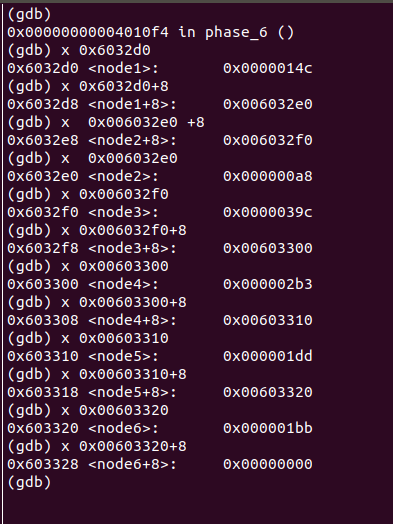
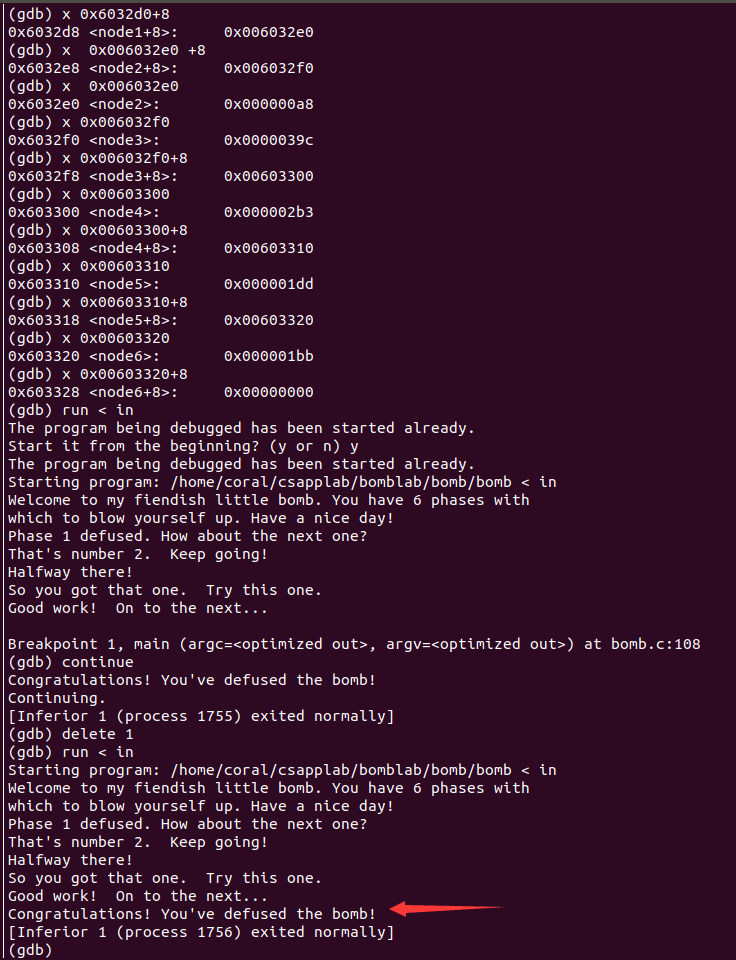

---

title: CSAPP 之 Bomb Lab
mathjax: false
copyright: true
comment: true
date: 2019-03-18 16:31:05
tags:
- Operating System
- CSAPP
- CSAPP Lab
categories:
- Computer Science
- Operating System

---


脑越用越灵，手越用越巧。


<!-- more -->

---


## 前言

没想到这BombLab果然有趣。一开始实验的时候还是有点困难的，主要是对GDB调试和一些知识点不够熟悉。虽然前面两个问题都有借鉴别人的方法。但是后面四个难度最大的真的是独立完成，完成的瞬间成就感不言而喻，达到climax。可能主要是对汇编有一点底子所以实验相对比较容易。


## CSAPP 实验记录



**[本系列文章](/tags/CSAPP-Lab/)主要记录 CSAPP 3.0 的实验过程，所有实验记录文章请查看[这儿](/tags/CSAPP-Lab/)**



快速开始请访问 `CSAPP` [Lab](http://csapp.cs.cmu.edu/3e/labs.html) 官网，本次实验记录是基于 CSAPP 3.0，实验日期始于：`2019-3-18`


## 实验开始前的归纳

 

这个实验首先要求对汇编有一定的掌握，所以在此就不列举汇编的相关内容了。个人感觉用到最重要也是想要入手必须要具备的知识：**一是学会使用反汇编及调试工具，二是了解函数调用的栈帧**。



### 栈帧

想要了解栈帧的结构？我们还是先来回顾（review）以下有哪些和函数栈相关的寄存器吧。（这儿并没有包含浮点寄存器）


- 所谓调用者保存，就是可以让被调用者（自身不作为另一个调用者）随意使用，也是为了自己用到的数据不被覆盖。
- 所谓被调用者保存，恰恰与调用者保存相反。
- 函数调用一般参数传递（非浮点）前6个参数存于寄存器，剩下的参数**按照函数定义从右向左压栈**。
- 栈指针指向函数栈栈顶。
- {% label primary@%rax%}用于保存函数调用返回值。


了解了这些寄存器，我们再来看看栈帧的结构




就拿函数P的栈帧来说，从栈底到栈顶的方向分别存储以下内容：

- 被保存的寄存器
- 局部变量（`sub $0x18,%rsp `）
- 如果调用其他函数参数多于6，便有参数构造区
- 调用其他函数时需要将返回地址压栈

### 工具使用方法

#### CGDB

跟随[孟佬](https://zhuanlan.zhihu.com/p/31269514)用的CGDB，[官网](https://cgdb.github.io/)及[gdb使用方式](http://csapp.cs.cmu.edu/3e/docs/gdbnotes-x86-64.pdf)，以下是CGDB运行缺省截图。




## Bomb Lab


BombLab家喻户晓，个人感觉之所以这个实验这么有名，主要有三点：

- 一是作为配套实验能够真正的训练学到的程序机器级表示的内容；
- 二是必不可少的一部分——实验的有趣性；
- 三是能够加强我们的调试程序的能力，终身受益（前提你是程序员:smile:）。


### 一开始

好了开始真正的实验部分了。

首先我们使用如下命令来开始调试`bomb`可执行程序：

```bash
cgdb bomb
```

就会看到如下界面：


这是给我们的主程序，里面主要是炸弹程序的初始化，以及这些炸弹的输入以及输入检测。

在CGDB模式下我们可以使用`:set disasm`命令将主程序以汇编形式展示，当然使用`:set nodisasm`就会返回原来的样子。


### 思路



所有炸弹拆除的思路都很简单，就是设断点，并一步步调试，找到跳转到`explode_bomb`的跳转命令，结合逻辑和寄存器的值进行判断如何避免跳转引发爆炸。



#### 运行

在GDB模式下，使用`run`命令开启调试。通过输入重定向的方法避免多次输入：`run < in.txt`

#### 设断点

在GDB模式下，使用`break 行号`打断点

#### 调试

设置断点后，具体参照GDB手册进行调试。

#### Example

比如想要破解Phrase1这个炸弹，需要执行以下步骤：

- 设置调用函数断点（`phrase_1(input)`处）
- 运行至断点处并调试（`stepi`+`nexti`+`finish`+`continue`等命令）
- 进入函数内部进一步观察（使用`print`+`x`等命令）
- 分析代码得出答案

### #Phrase Before

如果你是第一次做实验的话，这一步你一定要知道：


这六个炸弹都是都是通过一个`read_line`函数从输入流（不管是标准输入还是文件输入重定向）中读取的，返回值为`input`，对应于`%rax`寄存器（存放的一个输入字符串的首地址）。我们看到将`%rax`寄存器的内容转移到`%rdi`寄存器里了，我们知道寄存器`%rdi`用于存放调用函数时的第一个参数。接下来就调用炸弹函数了。


**再强调一遍，所有的炸弹函数的第一个参数`%rdi`都是我们输入的字符串的首地址。**


### #Phrase 1

第一个炸弹的汇编代码如下所示：


第一个算是一个入门的，主要是想让你熟悉一下BombLab的流程。

我们输入的字符串首地址在`%rdi`中；

②行申请了8个字节的栈空间；

③行将一个立即数（一看就是一个地址）存放到`%esi`寄存器（这是第二个参数）

④行调用了一个函数，如果你想快速通过的话不用看内部实现，是比较两个字符串是否相同。（内部比较就不说了，一个一个比较字符而已）


⑤行使用test命令（同`and`命令，不修改目标对象的值）来测试`%eax`中的值是否为0，如果为0则跳过引爆炸弹的函数。


很简单了，使用`x/s 0x402400`按字符串输出这个地址存储的内容（这个可能是我在比较字符串的函数内输出的 :smile: ）：


第一弹，拆除完毕！

### #Phrase 2

第二弹，来吧勇士！（好吧，感觉有点中二。）


嗯，映入我们眼前的是一个`<read_six_numbers>`函数，一猜也是让我们输入6个数字:


然后我们查看一下这个函数内部，发现里面又调用了`sscanf`这个函数（功能是从一个字符串中读取一定格式的数据，和`scanf`一样，除了`scanf`是从标准输入流中读取）。参数顺序分别是，待读取内容的字符串、用于格式读取的格式化字符串，还有各个变量读取后存放的地址。

```c
int sscanf( const char *buffer, const char *format [, argument ] ... );
```

我们查看`<read_six_number>`中参数构造如下：

- `%rdi`，输入传入的字符串首地址
- `%rsi`，由`0x4025c3`地址的字符串决定，不出意料果然是`%d %d %d %d %d %d`
- `%rdx`，由`%rsi`给出，`%rsi`又由`phrase2`的`%rsp`给出，所以`phrase2`中的`%rsp`地址处存放`sscanf`中第一个输入的值
- `%rcx`，`phrase2`中的`%rsp+0x4`处存放第二个值
- `%r8`，`phrase2`中的`%rsp+0x8`存放第三个值
- `%r9`，`phrase2`中的`%rsp+0xc`存放第四个值
- 第五个、第六个值所在的地址需要通过压栈传参，由栈帧压栈顺序是从右向左压栈，可知，`phrase2`中的`%rsp+0x10`存放第五个值、`phrase2`中的`%rsp+0x14`存放第六个值。

好了，知道输入的值都到哪儿去了，这样就简单了许多了，然后再看`phrase2`函数：


首先看**<+14>**处，第一个数必须是1，不是炸弹就爆炸。

不是就跳到**<+52>**处，然后**<+27>**到**<+52>**构成一个循环，意思是比较后一个数必须是前一个数的两倍。

那答案就出来了：`1 2 4 8 16 32`

### #Phrase 3

好了，兄嘚，第三炮！




输入还是`sscanf`函数，同理，`%rdi`是我们输入的，`%rsi`是`format`打印一下看是`%d %d`，需要两个地址存放，分别是`%rdx`和`%rcx`，对应于`%rsp+0x8`和`%rsp+0xc`。输入完成后，查看返回值`%eax`必须大于1，两个输入必然是最满足要求的。满足之后，我们来到了**<+39>**的位置，我们比较第一个输入值`x`和7，如果第一个`x`大于7则爆炸，所以`x`是<=7的。

接下来将x值放入`%eax`寄存器，然后通过间接跳转跳转到`0x402470+8*%eax`地址所存储的地址。我们可以看到这个跳转目标和输入有关的。然后我们可以输出相应的地址，发现跳转的地址刚好是修改`%eax`的地方，最终`%eax`都要和第二个数`y`（`%rsp+0xc`地址存储的值）相等。


就比如说x为0，则跳转到`0x402470`的地址中存储的地址（**<+57>**的位置），将`%eax`修改为0xcf（十进制207），然后跳转到**<+123>**处比较0xcf和`y`值，相等才不会爆炸。所以结果可以输入`0 207`。

答案还有好几个，不一一列举了！


### #Phrase 4

第四弹！

主要考察递归函数调用（当然你也可以避过这个问题！）

先看主要部分代码：



通过这个程序我们可以分析出，除了输入函数和爆炸函数之外，还调用了一个`func4` 函数。输入的是两个数字，存于`%rsp+0x8`和`%rsp+0xc`处。我们还可以分析出，**调用这个函数之后返回值`%eax`必须为0，而且第二个输入的数必须为0。**

我们再看传入的参数：

- `%rdi`：第一个数，记作x
- `%rsi`：0
- `%rdx`：0xe，即14
- `%rcx`：第二个数，记作y。不确定会不会用到，看到下面的代码很显然没用使用到，直接被覆盖了。


查看代码，如果你进入了递归是太恶心了，不过也可以分析，好像要求输入x值必须满足是一个数列的元素。那么如何避免递归，看**<+22>**行，可以分析出此时`%ecx`的值为7，如果`%edi`也就是x值如果>=7的话，那就会跳转到**<+36>**，此时将`%eax`置位0（满足返回值为0），然后再比较刚比较的`%edi`和`%ecx`，如果`%edi`<=7的话就结束。所以最终x=7满足条件。


所以很简单的答案，`7 0`。递归的值没仔细考虑，实在是递归太难调试了，可能是自己没掌握到方法。很遗憾。

### #Phrase 5

第五发！

这个也比较有趣，主要是涉及到了ASCII码，感觉真的是在破译代码，解除炸弹！

下面就是代码：


首先我们看到了`%fs`寄存器，这是用于存储`当前活动线程的TEB结构`地址的一个寄存器，和解题无关，可以不用在意。

首先输入的字符串地址在`%rdi`中，然后调用`string_length`函数，可以看电脑返回值`%eax`必须为6，也就是输入的字符串长度必须为6。

接下来的一段程序主要是以下作用：

- 取6个ASCII码低4位，记作`low4[i]`。
- 将`low4[i]`作为偏移量和常量A（0x4024b0）相加作为地址取得改地址存储的字符`character[i]`
- 将这一系列字符`character`分别存于`%rsp+0x10`到`%rsp+0x15`
- 调用`strings_not_equal`比较这些字符和存于**0x40245e**的字符串（flyers）是否相等，相等则结束

那么很简单了！

常量A地址开始存储的是什么字符？（忘了截图了……），是`maduiersnfotvbyl`共16个。我们找到`flyers`这六个字符的相对偏移地址用16进制表示分别为`9fe567`，然后据此查找ASCII码查看低四位相同的字符（答案不固定，我找到的是`ionufg`）。

完事！


### #Phrase 6

最后一弹，是有点难度的，一定要找一个比较好的环境做，需要大约2个小时的时间。争取一次性完成。

这一弹主要是考察循环了，循环炒鸡多有木有！另外还需要知道链表的结构。

由于代码太多，就不一一写了，主要是写一下代码的作用。

代码如下：

首先是第一部分：


首先读入了6个数字，分别放入了`%rsp+0x0、%rsp+0x4、%rsp+0x8、%rsp+0xc、%rsp+0x10、%rsp+0x14`

这是第一个大循环，**<+32>**到**<+93>**行，内嵌一个小循环**<+65>**到**<+87>**行。大循环中部分的作用是确定每个数必须<=6；小循环的作用是确定第`i`个数不和第`i+1`~第`6`个数相同（也就是输入的所有数字不能有相同的）。

接下来再看剩下的部分：



首先有个循环**<+103>**到**<+121>**，主要作用就是令`a[i]=7-a[i],i=1,2,3,4,5,6`，就是将存于栈中的数（也是你输入的数）进行对7求补并保存回原位置。

接下来又有一个大循环**<+130>**到**<+181>**部分，里面嵌入了一个小循环**<+130>**到**<+139>**。主要作用是访问一个链表，链表的首地址为`0x6032d0`，针对输入的第`i`个数，按照`a[i]`的值获取链表第`a[i]`个节点，并把节点首地址放入`%rsp+0x20+0x0`~到`%rsp+0x20+0x28`刚好是6个节点。


然后下面一段代码，又是一个循环**<+235>**到**<+257>**，主要是说明`%rsp+0x20+0x0`~到`%rsp+0x20+0x28`存储的链表节点值必须是递减的。

下面打印的是这六个节点的值和指向下一个节点的地址。



找到了各节点的值，我们就可以排序得到节点标号的排序，节点标号的排序恰恰是输入6个数字对7求补的值，然后再对7求补即可得到结果`4 3 2 1 6 5`。


## 结果

完成的一瞬家很爽！秀一下结果！




## 总结

这次实验真的是收货颇丰，一是完成了大名鼎鼎的bomblab，二是切切实实的学到了新东西。

### 所感

- 相对于上次实验，感觉动手能力变强了
- 自己有一些浮躁
- 实验时有时走神，（主要是没有草稿时是这样的，没草稿直接看是很难看出答案的。。我太菜。）

### 所得

- 学会了GDB的使用方法，对调试又有了一定的认识
- 彻底理解了栈帧的设计
- 熟悉了一些常用寄存器的用途
- 熟悉了AT&T x86-64汇编指令

### 下一步

1. 实验时要草稿纸，好记性不如烂笔头
2. 静下心来，莫浮躁，循序渐进。
3. 阅读英文书籍，增强英语环境下的学习能力