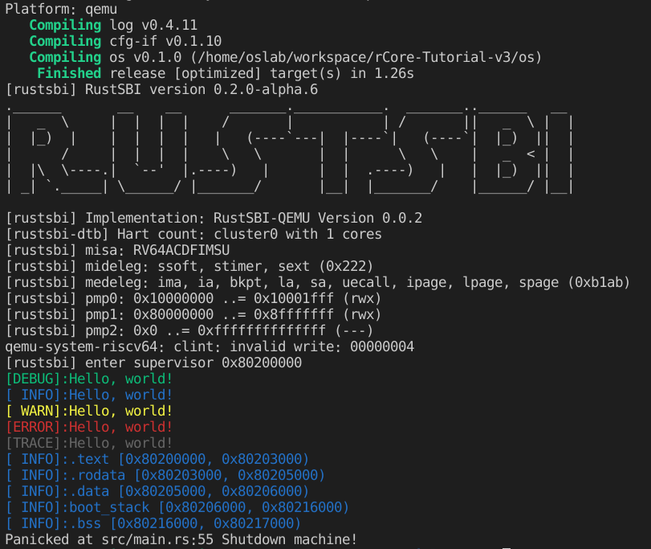


实现彩色打印 Hello World。


<!-- more -->

---

## 实验要求

- 实现分支：ch1

- 完成实验指导书中的内容并在裸机上实现 hello world 输出。

- 实现彩色输出宏(只要求可以彩色输出，不要求 log 等级控制，不要求多种颜色)

- 隐形要求：可以关闭内核所有输出。从 lab2 开始要求关闭内核所有输出（如果实现了 log 等级控制，那么这一点自然就实现了）。

- 利用彩色输出宏输出 os 内存空间布局

-  输出 .text、.data、.rodata、.bss 各段位置，输出等级为 INFO。

> challenge: 支持多核，实现多个核的 boot。

## 开始



代码详情参考[Github](https://github.com/ScarboroughCoral/rCore-lab/tree/ch1)



基于[rCore-Tutorial-v3](https://github.com/rcore-os/rCore-Tutorial-v3) 的 `ch1` 进行开发彩色打印“hello world”很简单，只需要参考`println!`宏进行实现即可，难点在于裸机打印。

先晒结果：



### 打印彩色字体
彩色打印是基于[ANSI转义序列](https://zh.wikipedia.org/wiki/ANSI%E8%BD%AC%E4%B9%89%E5%BA%8F%E5%88%97)。在shell中执行如下命令就可以打印彩色字体。

```bash
echo -e "\x1b[31mhello world\x1b[0m"
```

在前端开发中，浏览器 devTools 的输出也支持彩色打印字体、背景等，跟上述shell打印是一样的。

```js
console.log('\x1b[31mhello world\x1b[0m')
```

### 在裸机上实现 hello world 输出

首先要了解在操作系统支持下打印“hello world”和在裸机上打印的区别。知道在操作系统支持下打印“hello world”究竟发生了什么，这是如何在裸机上打印的关键点。
首先我们假设使用Rust向标准输出流打印“hello world”，会编写如下代码：
```rust
fn main() {
    println!("hello world");
}
```
然后执行`cargo run`或者直接通过`rustc`进行编译执行，这样标准输出设备上就会显示“hello world”了。`println!`是一个rust标准库支持的宏，这个宏的实现实际上又调用了操作系统的系统调用，系统调用再调用硬件接口来实现打印功能。

然而我们要在裸机上打印“hello world”，假设我们还需要使用上面的程序代码实现，这就有问题了，裸机并没有操作系统，所以没有系统调用供rust标准库来实现打印宏。

还有一个问题，就算是裸机也有不同的硬件支持，我们编译的程序也需要知道编译结果需要在什么平台上运行，即目标平台，一般用（CPU架构，CPU厂商，操作系统，运行时）来区分，比如我们实验的平台就是`riscv64gc-unknown-none-elf`。rust标准库在裸机平台上没有实现，但在一些平台，比如`riscv64gc-unknown-linux-gnu`这种有操作系统和运行时的平台rust标准库是有实现的。

综上，我们需要做的就是直接调用操作系统之下的运行环境接口（SBI，Supervisor Binary Interface）来打印而不使用标准库，并将rust程序编译为`riscv64gc-unknown-none-elf`平台上的程序，然后在对应裸机上执行。

在这里，使用`qemu-system-riscv64`来模拟riscv裸机环境，其中有一些限制，你需要知道这个裸机对应的bootloader应该放在内存哪里，bootloader执行完成后跳转到的我们的程序起始位置在哪里。

### log 控制等级、展示不同颜色

因为rust有现成的crate可用，使用了log这个crate，只需要实现`Log`接口即可通过等级来打印不同颜色的日志，也可以设置最强日志等级进行拦截。

### 利用彩色输出宏输出 os 内存空间布局

获取内存空间布局，即各个段的位置，即获取一些全局符号，`.stext`、`.etext`等的位置，在这里我们使用如下代码：
```rust
    extern "C" {
        fn stext();
        fn etext();
        fn srodata();
        fn erodata();
        fn sdata();
        fn edata();
        fn sbss();
        fn ebss();
        fn boot_stack();
        fn boot_stack_top();
    }
```
这是根据“C”这种约定的ABI来进行获取全局符号，这样我们就获得了各个段的开始和结尾。


## Reference
- https://rcore-os.github.io/rCore-Tutorial-Book-v3/appendix-c/index.html