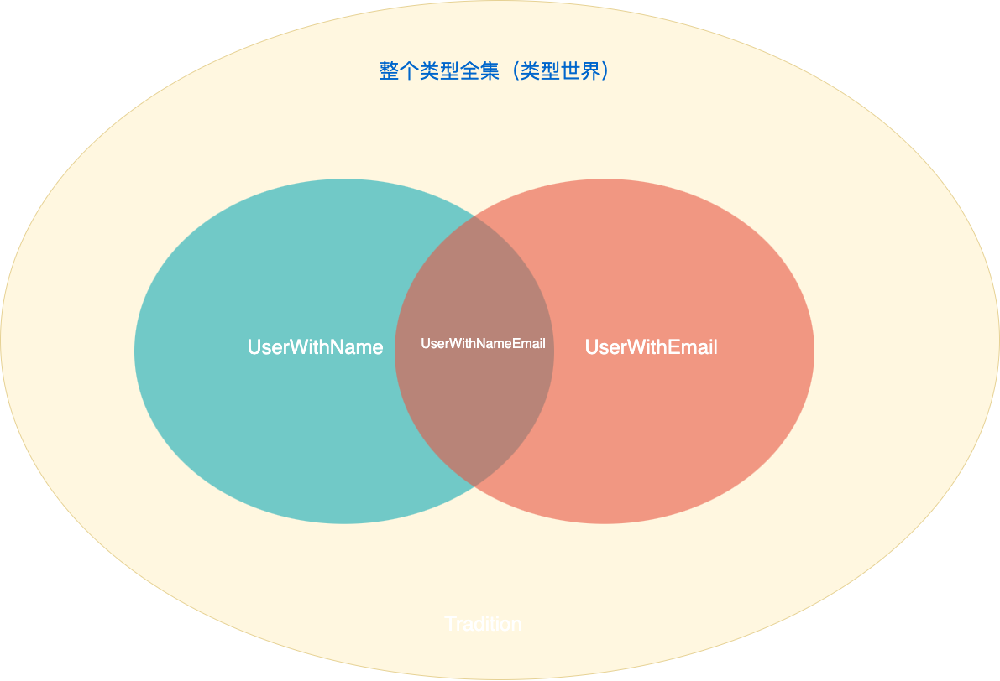


类型也有代数运算，类型也有逻辑。


<!-- more -->

---

## 前言

本文适合以下读者：
1. 想了解为什么要使用 Typescript。本文会展示 Typescript 的优势
2. 对类型体操的实际应用有怀疑。本文会展示实际业务中常见类型应用
3. 想了解 ADT（代数数据类型）。类型也有概念上的加减乘除，这并不是类型体操。

## 主要内容

- Typescript 的优势（本文）
  - 通过集合理解类型
  - 自定义类型的集合运算
- 实际业务中常见类型操作应用
  - 代数数据类型
  - 穷尽枚举
- 代数数据类型拓展

## Typescript 的优势

优势是相对而言的，要说优势就是说 Typescript 相对于 Javascript 的优势。那么 Typescript 相对于 Javascript 的优势是什么呢？

最近作者面试一些前端开发人员，都会说 Typescript 是 JavaScript 的超集，提供了静态类型检查，但是仅限于使用 interface 和 type 定义类型，会使用一些简单的 Utility Types。这样回答往往表现的了解不够深入。

有些人可能会说出 interface 和 type 的区别够深入吗、会很多类型体操（例如使用类型进行排序）这样够深入吗、了解distributive conditional types 够深入吗？这确实能体现出你理解的深度，如果确实能应用到实际开发中那才能体现你的优势，这些往往在开发一些工具基础库的时候会使用，平常业务开发几乎不会使用到。

让我们先思考这样一个问题，Typescript 提供了静态类型检查，那我们可以通过静态类型检查来帮我做哪些事情呢？

静态类型检查可以让我们在类型出现错误的时候就会出现编译错误，这样就可以把这部分错误过滤掉，不会出现在运行时。往往运行时再去发现修改要比编译时发现修改成本要高的多，甚至需要在测试阶段发现。

既然如此，我们能不能尽可能的将代码错误或者说业务错误拦截在编译阶段呢？能不能通过定义完类型之后通过编译错误拦截，一步一步修改错误，错误修改完成了，业务逻辑也写完了呢？

如果你了解一些高阶类型的语言例如 Haskell，甚至一些证明助手例如 Coq，你就会发现这些语言的类型系统是非常强大的，可以帮助我们做到这些事情。但是 Typescript 的类型系统并不是很强大而且业务开发中写太多的类型定义也会让人效率低下，实际上我们可以通过一定程度的类型定义来完成编译通过即写完业务代码。这是下一篇文章重点讲解的。

本文主要讨论如何理解类型：

#### 通过集合理解类型

在说这些方法之前，我们先来思考一下什么是类型，我们可以通过集合的角度来思考类型，把类型当作集合、把值当作集合中的元素。如果了解过类型论就知道三个概念：项（可以先理解为变量）、类型、上下文。这三个概念的关系通常可以描述为在某个上下文中某个项是某个类型。例如下面这段代码：

```typescript
const a: number = 1
{
    const a: string = 'a'
}
```
我们可以描述为在外层的作用域上下文中 a 这个项的类型是 number，在内层的作用域上下文中 a 这个项的类型是 string。

把类型当作集合、把值当作集合中的元素，就没办法把不属于这个集合的元素赋值给属于这个集合的变量。那么考虑一下 Typescript 中的这些类型。

```typescript
// boolean 这个集合中有两个元素 true 和 false，没法把不属于这个集合的元素赋值给属于这个集合的变量
const a: boolean = true 
const b: boolean = false
// @ts-expect-error
const c: boolean = 1 // Type '1' is not assignable to type 'boolean'
```
1 这个元素不属于 boolean 这个集合，所以没法把 1 赋值给 boolean 类型的变量。

再看看另一些类型（集合）。
```typescript
// number 集合里包含所有数值元素，NaN也属于数值元素。
const num: number = 1; 
 // string 集合里包含所有字符串元素。
const str: string = 'a';
 // number[] 集合里包含所有“number数组的实例”。
const numArr: number[] = [1, 2, 3];
 // unknown 集合里包含所有元素，unknown 集合是全集，也就是所有集合的父集。
const unknown: unknown = 1;
// never 是空集，没有任何元素，所以没法把任何元素赋值给 never 类型的变量。
// @ts-expect-error
const never: never = 1
 // undefined 集合里只包含 undefined 元素。
const undefinedValue: undefined = undefined
 // void 集合有点特殊，大部分情况下代表 undefined，后续作者后再写一篇文章来讨论。
const voidValue: void = undefined;
const voidReturnedFunction: () => void = () => {
}
```
如果上述类型不确认的话，可以打开 [Typescript Playground](https://www.typescriptlang.org/play?#code/PTAEDsFcFsCMFMBOpBjaYCBVAziYUGVDUKoASNBIc0AdTQHgVBhRUAJfQGH+A5AQxsH05QPR1A4uVMsCAGAKAGMB7cAGcALhBgAucXCSgAvKACMAblDdQIUKMQBLcAHNUmXIUDq2oDJvQExyXPoNFaRiKdr2GFAcjrvl6zVBmIANoAukbY+ASAOAT+CIhEgCN+gCFugHnagNHygLgEPALCYv4AgohO0rEh8qCBigA0oABM1QDMwT4aYJDgANbg-ADu4GEmBJRUbZ09feiA9GaAFoooVIyAjDoThOiJgGxOKFl2YiNdvVI7Y2Uq3H7wAG6yE4BeXrOAhTYEgN9ygKryQ3iAp3K3gKs2gFFGz5SA0rEkQCbfhBzrJAN4+gGj1RKADeVAPOJPE0AAEREIALTwAAeAAd4LwRBjCvxELYcqCLkVwGCSS1QG0ACbwABmeng9LCgCvlXB08CMllU9k2bL2BnM1n0gBqdAANpB4PteWKBWVRfy2b4wGd+Dp2egCIBOh0Ank6AKOtSfYtTqpbL5aALeyFKrxT5hWI7QAleAiSCIAUAMTa+J0gikAAoAJTyAB8tu19tA4ajoAA3twAL5AA) 来尝试一下。

现在来思考这样一个问题，如果一个元素属于某个集合A，那么这个元素也属于这个集合A的父集。
```typescript
const a: unknown = 1
const b: unknown = 'a'
```
因为 unknown 是全集，所以所有元素都可以赋值给 unknown 类型的变量。

我们既然把类型当作集合，那么我们就可以使用集合的运算来描述类型的运算。我们知道常见的集合运算有并集、交集、差集等等。我们可以通过这些集合运算来描述类型的运算。

```typescript
// 并集运算可以通过联合类型操作符 “|”来实现。
// number | string 集合包含所有 number 和 string 集合的元素
type StringOrNumberUnion = string | number
const num: StringOrNumberUnion = 1
const a: StringOrNumberUnion = 'a'

// 交集运算可以通过交叉类型操作符 “&”来实现。 
// number & string 集合的交集是空集，也就是never，所以没法赋值给 number & string 类型的变量。
// @ts-expect-error
const numAndString: number & string = 1
// unknown & number 集合包含所有 number 集合的元素（集合同一律，全集与任意集合A的交集就是集合A）。
const n: unknown & number = 1;


// 差集运算可以通过排除类型操作符 Exclude Utility Type 来实现。
// Exclude<number, string> 集合是number - string 这个差集，也就是 number。
const excludeStringFromNumber: Exclude<number, string> = 1;
// Exclude<number|string|boolean, string> 集合就是 number|string|boolean - string 这个差集，也就是 number|boolean。
// @ts-expect-error
const excludeStringFromNSB: Exclude<number|string|boolean, string> = 'string';

```
可以使用 [Typescript Playground](https://www.typescriptlang.org/play?#code/PTAEjc9QxtMBfjHTvR75UKdygsBMOPxgVAMBAqhvH0NHqhZk0B15QMm9RAcAgB9BcAkFNzQPO1AG50CAGAKBFADsBXAWwCMApgCdQFUAGcALkICWHAOahImQKDKgahVAAkaBIc069BIwDEqE6XMXLAIW6BhRUAEvi0kBPAA4DQAZRMKA8kIBye4QCqHDIA9hygALzGsgqiuvzCLADGYVLxAFxuHvLefglCQaHhUQCMyamSoACGme4xOb7+BcFhkaAA5FXtLGxggCVyMAgoqH2Ak8p4RKRkAGS0jEygvfH6oNPRpkqY5gOA9GaAXl6QgDD-gPpygIw6OxwCAG7ChxqIgIU2gKs2gNKxgDwKgJt+y8Kr67F45kAG8qAecTWOwAAKScQAWgEAA9nElJLChEIQkJyhw0tweABBDgAEzqpkyOJWayk9TaZXYXA4AGsOCEAO7hNZkn7KdTab4iCw2QAQ-8pADAqgAA5QDR+odABaKkEAcHKAb7lAPCGylx20g5xVgEh-1gpLGVDiZOmMlls3nUgDcPSWgDvdQZINCAJONACZpExIoAAonCkgAbLgElwBSQyb0yBygAAqThc9GYS09Pr9AgAPByhAAaP7yAB8mwuTVA0MzoEAm-GAKjlbSdzrydRVQPCE-7iQoAGJonh5fSZeO+-0ppoZymmHOlS3sbuJvv5CiDhQUPghELegRVDgD7I55RV1PT7JzhdLlcFotlitnHa8veL5ccMFgSEw+GI5HCNEY3Vpes9gRN+StkLt1wACEuy9L9J30Hd6kvA9V0zYcOhneR2nNIA) 打开上述代码。


#### 自定义类型的集合运算

我们来看一下自定义对象类型的集合运算，我们通过交集来举例，看下面这个例子：
```typescript

// UserWithName 集合的元素特征是拥有 name，其他特征不确定
type UserWithName = {
  name: string
}
// UserWithEmail 集合的元素特征是拥有 email，其他特征不确定
type UserWithEmail = {
  email: string
}
// UserWithNameAndEmail 集合的元素特征是拥有 name 和 email，其他特征不确定
type UserWithNameAndEmail = UserWithName & UserWithEmail
const user: UserWithNameAndEmail = {
  name: 'Sam',
  email: 'sam@a.com'
}
```
可以用下图描述：


这个类型世界很大很大，我们在这个集合中寻找我们使用的子集。UserWithNameAndEmail 这个集合很大很大，因为除了name和email之外还有其他不确定的特征，这个集合就是一个无穷集合。

后面的文章我们会讨论如何衡量集合（类型）大小，以及代数数据类型是个什么东西。

点赞收藏不迷路，这是我持续创作的最大动力，我们下期见。